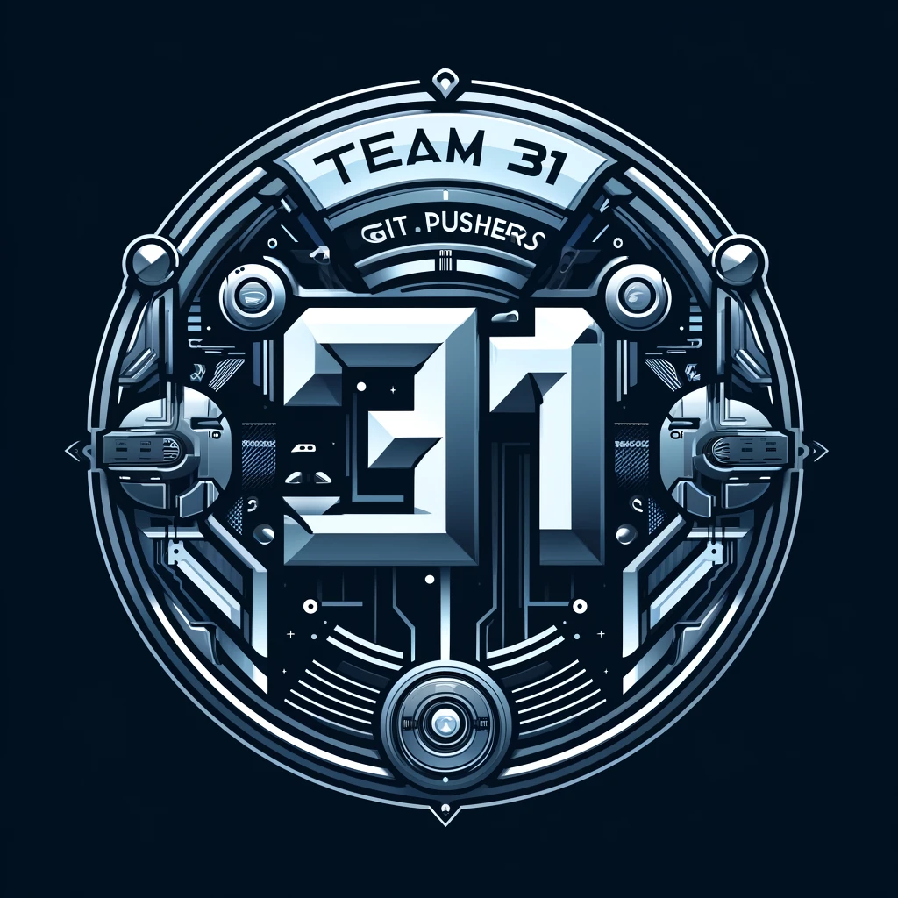

# Git Pushers

## Members 
Kevin Truong: I am a third year computer science major transfer. My biggest interests are game design and ai and I hope to find a job under that. Some seperate interests I have include playing games and working out. I don't have any experience in software engineering but hope to learn a lot this quarter. [Github Page](https://github.com/azuk132435) 

Brian Wen: I am a third year computer science transfer in Marshall. My interests are Computer Graphics and Natural Lanaguage Processing. [Github Page](https://github.com/briannwhen)

Charlotte Dong: I am a third year Computer Engineering major. I love solving puzzles. [Github Page](https://github.com/charl0ttedqy/CSE110)

Gavin Guyal: I am a second year computer science major interested in pursuing software engineering as a career.  [Github Page](https://github.com/gguyal)

Ishan Vaish: I'm a second year computer science major interested in pursuing AI as a career. [Github Page](https://github.com/Ishxn20) 

Liam Mohler: I'm a second year cs major in Marshall. Currently, im interesting in pursuing software engineering. [Github Page](https://github.com/LiamMohler)

Newton Chung: I am a third year math-cs major pursuing a career in software development, though I'm still considering other areas in computer science. [Github Page](https://newtonlc.github.io/CSE110/)

Nikhil Mahendran: I am a second year cs major and am perusing a career within CyberSecurity [Github Page]

Zhamilya Shakirova: Hi! I’m Zhami, a second-year computer science student. I’m international student from Kazakhstan. [Github Page](https://github.com/zshakirova)

Zilin Liu: I am second year Computer Engineering major. My interest is game design [Github Page](https://github.com/kiminus). 

### Team Values
* Teamwork: Make sure everyone is involved at all times and contributing to the group
* Communication: Thoroughly talk through and plan everything before we take aciton. The best way to achieve success is through communication and proper planning.
* Flexibility: Everyone has different schedules and things going on in life. We value this and present lots of flexibilty to make sure everyone can participate.
* Professionalism: The success of everyone is dependent on everyone. Everyone is expected to try their best to complete their tasks.
